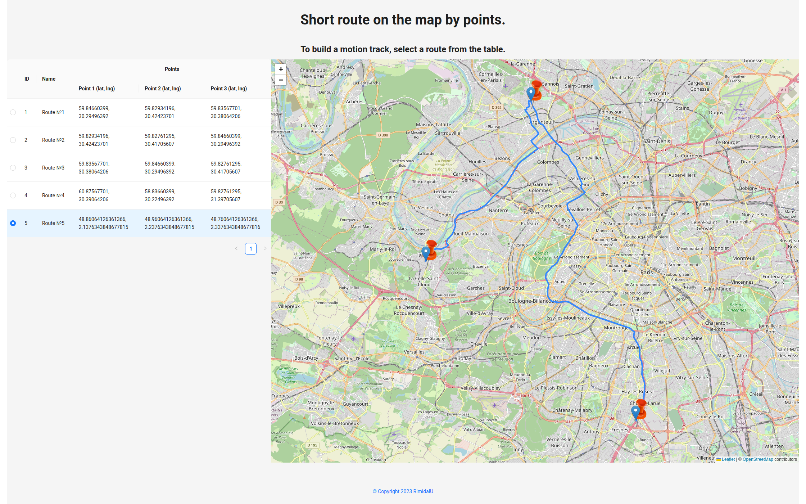

# Short route on the map by points.

> Single page application in React to display a short route on the map by points.

---

[Description](#description) •
[Project setup](#project-setup) •
[Features](#features) •
[How To Use](#how-to-use) •
[Project Status](#project-status) •
[Room for Improvement](#room-for-improvement) •
[License](#license) •
[Contact](#contact)

## Description

SPA in React, RTK, Redux-saga, TypeScript and Ant-Design for display a short route on the map by points.
Leaflet - interactive map shell. Maps - OpenStreetMap. Short path calculation - OSRM under the hood leaflet-routing-machine plugin.

## Project setup

- Clone this repo to your desktop and run `yarn` or `npm install` to install all the dependencies.
- Once the dependencies are installed, you can run `yarn dev` or `npm dev` to start the application.
- Enjoy.

## Features

- State in Redux Toolkit.
- Redux-saga when working with API.
- Adding points to the map.
- Request to calculate the route by points and plot it on the map.
- Scaling and centering by points.
- Fetch API.

## How To Use

Run [Live Demo](https://short-route-on-the-map-by-points.netlify.app/)

![tutorial][tutorial]

## Project Status

Project is: _in progress_

## Room for Improvement

To do:
- [ ] Change layout
- [ ] Add header with full description

Improvement:

- [ ] Implement creating and removing new routes
- [ ] Implement adding points to route

## License

This project is open source and available under the [MIT](../LICENSE).

## Contact

Created by [@RimidalU](https://www.linkedin.com/in/uladzimir-stankevich/) - feel free to contact me!

<!-- MARKDOWN LINKS & IMAGES -->
<!-- [tutorial]: ./assets/screencast.webp -->

[tutorial]: ./assets/demo.webp
